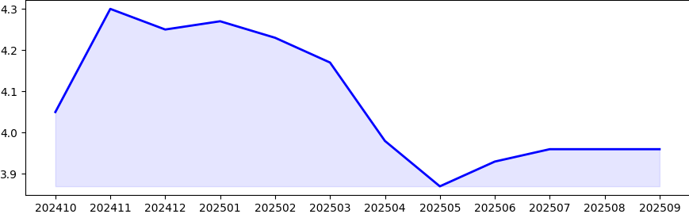
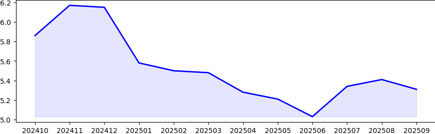

# 📈 최근 1년간 대출 금리 흐름

## 🏠 주택담보대출

### 📋 월별 금리 데이터

|날짜|ITEM_NAME1|DATA_VALUE|
|---|---|---|
|202408|주택담보대출|3.51|
|202409|주택담보대출|3.74|
|202410|주택담보대출|4.05|
|202411|주택담보대출|4.3|
|202412|주택담보대출|4.25|
|202501|주택담보대출|4.27|
|202502|주택담보대출|4.23|
|202503|주택담보대출|4.17|
|202504|주택담보대출|3.98|
|202505|주택담보대출|3.87|
|202506|주택담보대출|3.93|
|202507|주택담보대출|3.96|

## 💳 일반신용대출

### 📋 월별 금리 데이터

|날짜|ITEM_NAME1|DATA_VALUE|
|---|---|---|
|202408|일반신용대출 2)|5.65|
|202409|일반신용대출 2)|5.87|
|202410|일반신용대출 2)|5.86|
|202411|일반신용대출 2)|6.17|
|202412|일반신용대출 2)|6.15|
|202501|일반신용대출 2)|5.58|
|202502|일반신용대출 2)|5.5|
|202503|일반신용대출 2)|5.48|
|202504|일반신용대출 2)|5.28|
|202505|일반신용대출 2)|5.21|
|202506|일반신용대출 2)|5.03|
|202507|일반신용대출 2)|5.34|

